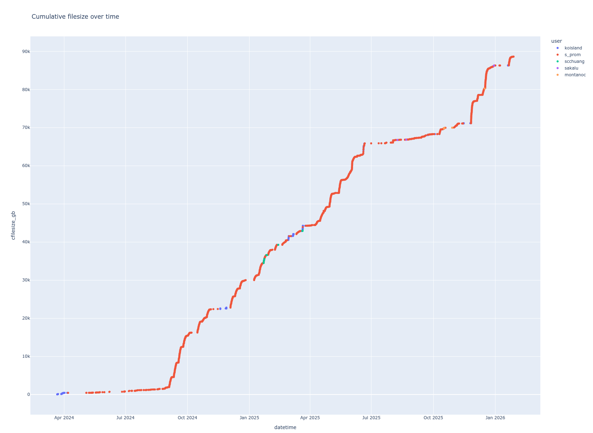
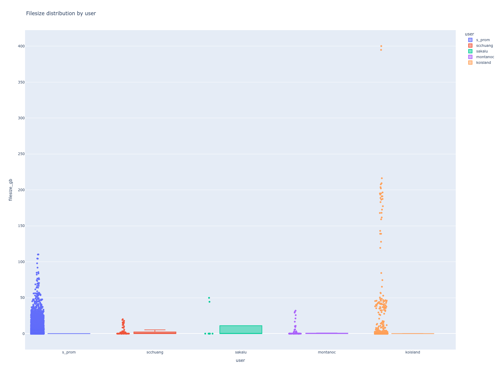

# Filesystem figures
Scripts to plot interactive filesystem summaries.

<table>
  <tr>
    <td>
      <figure>
          
          <br>
          <figcaption>Cumulative size colored by user</figcaption>
      </figure>
    </td>
    <td>
      <figure>
          
          <br>
          <figcaption>Filesize distribution by user</figcaption>
      </figure>
    </td>
  </tr>
</table>

## Getting started
```bash
which snakemake
git clone https://github.com/koisland/filesystem_figures.git
```

## Config
```yaml
output_dir: results
dirs:
  data:
    path: /project/logsdon_shared/data
  long_read_archive:
    path: /project/logsdon_shared/long_read_archive
  project_archive:
    path: /project/logsdon_shared/project_archive
  projects:
    path: /project/logsdon_shared/projects
    # Plot args. See workflow/scripts/plot.py
    plot_args: "--min_filesize_gb 2.0"
  tools:
    path: /project/logsdon_shared/tools
# Ignore specific patterns with find -wholename
ignore_patterns:
  - "*.snakemake/*"
  - "*.git/*"
```

## Usage
```bash
snakemake -p --workflow-profile ~/profiles/lpc -j 6
```
