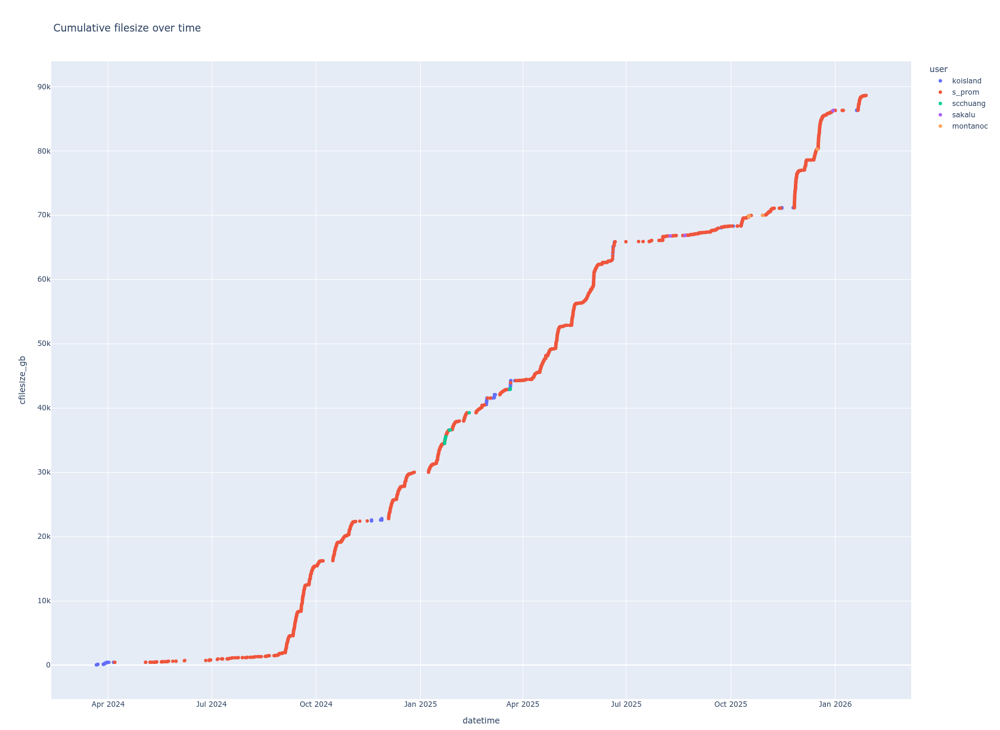
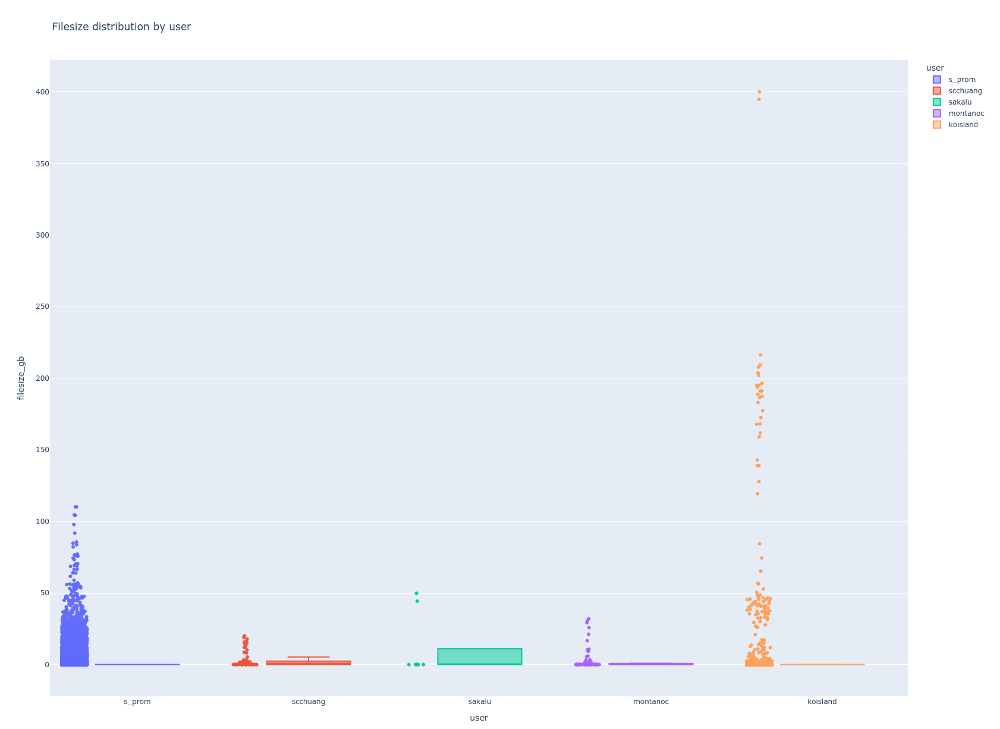

# Filesystem figures
Scripts to plot interactive filesystem summaries with plotly.

<table>
  <tr>
    <td>
      <figure>
          
          <br>
          <figcaption>Cumulative size colored by user</figcaption>
      </figure>
    </td>
    <td>
      <figure>
          
          <br>
          <figcaption>Filesize distribution by user</figcaption>
      </figure>
    </td>
  </tr>
</table>

## Getting started
```bash
which snakemake
git clone https://github.com/koisland/filesystem_figures.git
```

## Config
```yaml
output_dir: results
dirs:
  data:
    path: /project/logsdon_shared/data
  long_read_archive:
    path: /project/logsdon_shared/long_read_archive
  project_archive:
    path: /project/logsdon_shared/project_archive
  projects:
    path: /project/logsdon_shared/projects
    # Plot args. See workflow/scripts/plot.py
    plot_args: "--min_filesize_gb 2.0"
  tools:
    path: /project/logsdon_shared/tools
# Ignore specific patterns with find -wholename
ignore_patterns:
  - "*.snakemake/*"
  - "*.git/*"
```

## Output
|outfile|description|
|-|-|
|`summary/{dir}.tsv.gz`|TSV file with columns: `["user", "datetime", "filesize_blocks", "abspath", "is_uncompressed", "is_tempfile"]`|
|`plots/{dir}_cfilesize.html`|Plot with cumulative filesize since the start of the lab|
|`plots/{dir}_filesize_boxplot.html`|Plot of files by filesize|
|`plots/{dir}_total_by_user.html`|Plot with totals by user| 

## Usage
Run workflow.
```bash
snakemake -p --workflow-profile ~/profiles/lpc -j 6
```

Generate report with HTML files.
```bash
snakemake --report report.html
```
